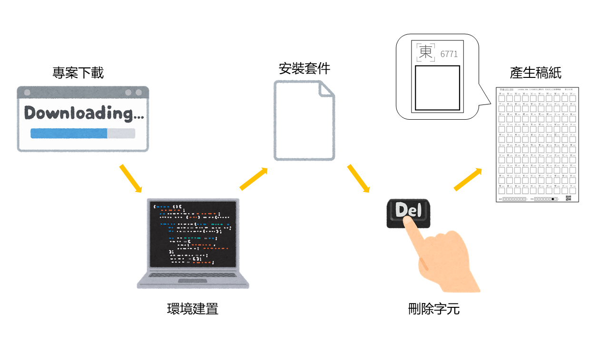

# Generate Manuscript Paper
[[Github]](https://github.com/lctung/01-1_generate_paper) [[Hackmd]](https://hackmd.io/@tung23/r1KVpaO8Wx) `114-2 生成式人工智慧`

```
# [稿紙對應編號]
1. 千字文
2. 長恨歌
3. 洛神賦
4. 詩經
5. 部首、注音、日文
6. 英文、數字
7. 標點符號
8. 姓氏名字號
```
## 🔆環境建置(初次設定)
### 1. 下載專案
點擊右上角綠色 `CODE` --> `DOWNLOAD ZIP`
### 2. 安裝 Conda
點擊 [Anaconda](https://www.anaconda.com/download) 註冊帳號，並安裝 miniconda
### 3. 建立虛擬環境
```
conda create --name gen_paper python=3.8
```
### 4. 啟動虛擬環境
```
conda activate gen_paper
```
### 5. 切換目錄至 `0_env_gen_paper`
```
# 請根據下載的專案資料夾位置更改路徑
cd D:\NTUT\AI\Font-Project\01-1_generate_paper-main\0_env_gen_paper
```
### 6. 安裝套件
```
pip install -r requirements.txt
```
### 7. 檢查套件
```
conda list
```
- 是否符合 `requirements.txt` 內的套件與版本

-----
## 🔆啟動與進入專案
### 1. 啟動虛擬環境
```
conda activate gen_paper
```
### 2. 移動至專案目錄
```
# 請根據下載的專案資料夾位置更改路徑
cd D:\NTUT\AI\Font-Project\01_generate_paper-main
```
## 🔆製作的稿紙範圍
### 編號 1~4
- 請繼續往下執行 [設定稿紙](#set_the_paper)
### 編號 5~8
- 請先前往 [紀錄寫過的字元](#history_char)
- 以上步驟總共只須執行一次。若已完成，請繼續往下執行  [設定稿紙](#set_the_paper)
<span id="set_the_paper"></span>

## 🔆設定稿紙
### 1. 選擇稿紙內容
- 將該次[作業](https://tjhsieh.github.io/c/ai/ai2026s/hw/index.html)的指定稿紙內容貼至 `manuscript_paper.txt`
- 貼上時，請略過所有 **來源連結**、**標題**
- 除了 `詩經` 請連標題一起貼
- 有 **空行**、**空格**、**標點符號** 沒關係

### 2. 切換目錄至 `1_generate_CP950`
```
cd .. 
cd 1_generate_CP950
```

### 3. 刪除稿紙中的不必要字元
```
python 1_preprocess_characters.py
```
- 請輸入稿紙標題 (ex. 千字文)
    - 輸入標題以區分不同稿紙
    - 標題會記錄在 `01-1_generate_paper-main\\2_generate_manuscript\\info.json`
- 是否刪除指定字元(y/n)
    - y: 刪除指定字元，如：，。；「」等
    - 適用稿紙： `千字文` `長恨歌` `洛神賦` `詩經`
- 是否去除重複字元(y/n)
    - y: 去除曾經出現在`千字文` `長恨歌` `洛神賦` `詩經` 的字元，以及刪除同份稿紙內容中的重複字元
    - 適用稿紙： `部首、注音、日文` `英文、數字` `標點符號` `姓氏名字號`

### 4. 產生 `CP950-{title}.json`
```
python 2_generate_CP950.py
```
- `{title}` : 執行完 `2_generate_CP950.py`，會替換為前一步輸入的**標題**
- 是否按照 unicode 排序(y/n)
    - y: 按照 unicode 順序由小到大排序
    - 適用於 `部首、注音、日文` `英文、數字` `標點符號` `姓氏名字號`
- 檢查 `CP950-{title}.json` 是否出現指定稿紙內容
----
## 🔆製作包含 CP950 所有字元稿紙

### 1. 切換目錄至 `2_generate_manuscript`
```
cd ..
cd 2_generate_manuscript
```

### 2. 修改與檢察 `info.json`
```json
"TITLE": "千字文", # check the title
"TOTAL_CHARACTERS": 1000, # check the number of characters
"TOTAL_PAGES": 10, # check the pages
"ID": "你的學號", # enter your ID here
"NAME": "你的名字", # enter your name here
"NUMBER": 0 # enter your number here
```

### 3. 執行程式碼
#### (1) 生成 svg 稿紙
```
python 1_SVGtable.py
```
#### (2) 在 svg 稿紙加上 QRcode
```
python 2_QR_add.py
```
#### (3) svg 轉成 pdf
```
python 3_SVG2PDF.py
```
#### (4) 多個 pdf 檔案合併成一個 pdf 檔案
```
python 4_PDFmerge.py
```
<span id="history_char"></span>

## 🔆紀錄曾經寫過的字元

本步驟只要完成一次，就可以繼續往下製作以下稿紙內容 `部首、注音、日文` `英文、數字` `標點符號` `姓氏名字號`


### 1. 稿紙內容
- [作業網站連結](https://tjhsieh.github.io/c/ai/ai2026s/hw/index.html) 
- 將前4份稿紙內容貼至 `all_manuscript.txt`
- 貼上時，請略過所有 **來源連結**
- 有 **空行**、**空格**、**標點符號** 沒關係

### 2. 切換目錄至 `1_generate_CP950`
```
cd .. 
cd 1_generate_CP950
```

### 3. 整理已出現過的字元
```
python char_history_tracker.py
```
- 刪除空白字元
- 刪除重複字元

### 4. 完成
請回到 [設定稿紙](#set_the_paper)


